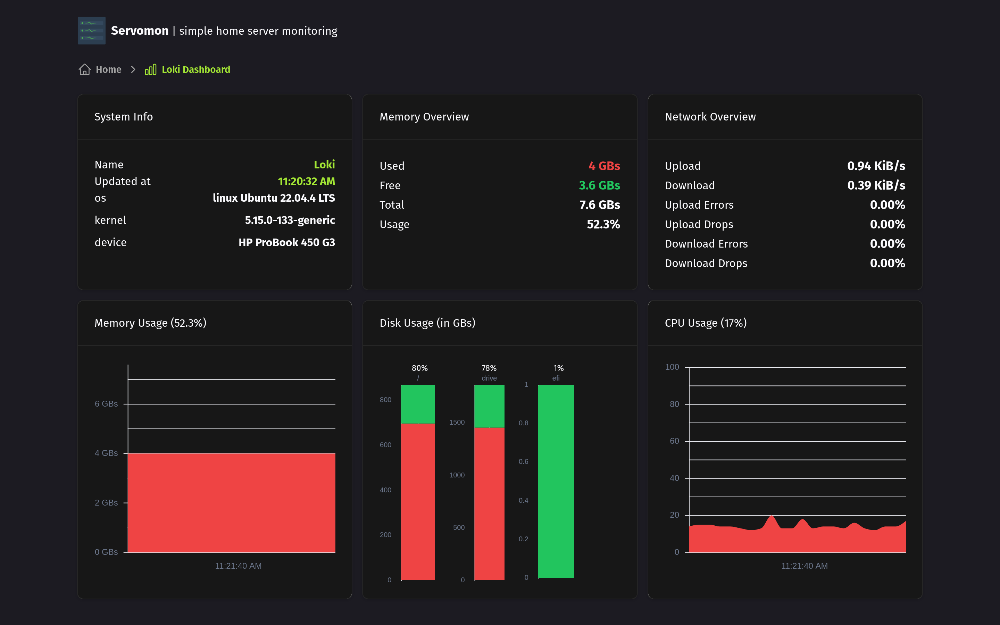
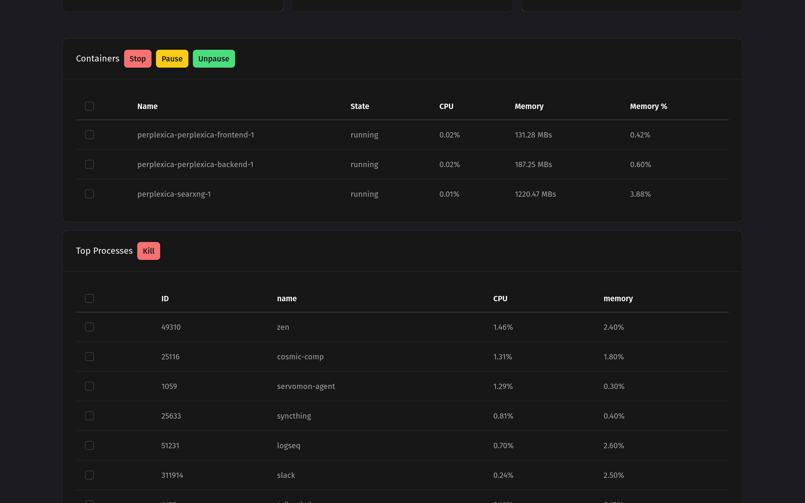
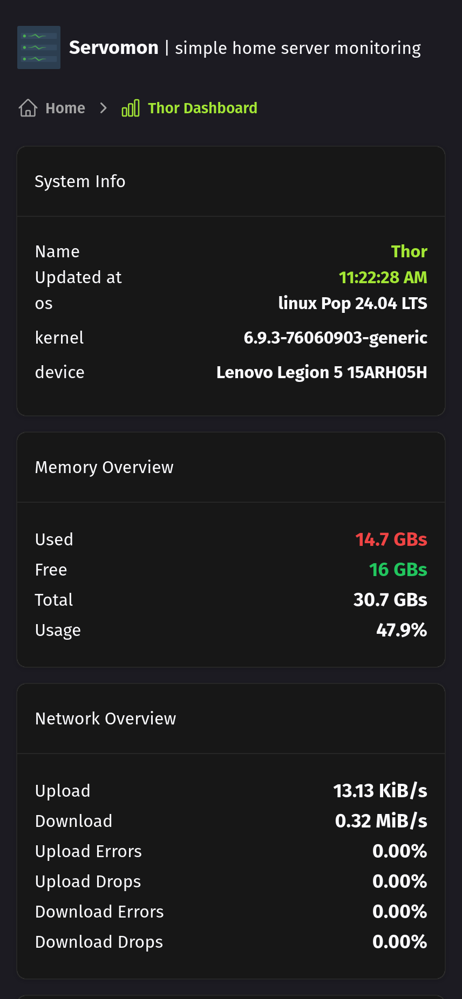
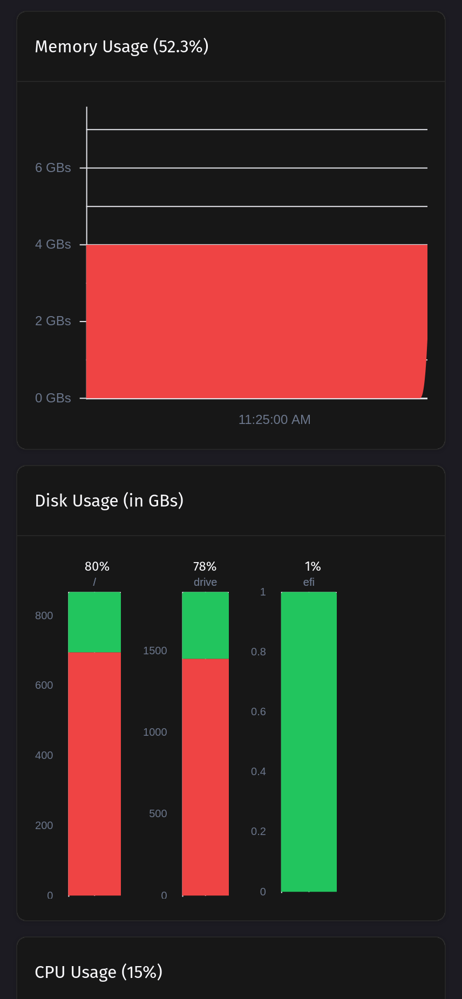

# Servomon - Simple Home Server Monitoring

Servomon helps you monitor Linux web servers through an easy-to-use web app. It consists of two parts:
- A web app for viewing server metrics
- An agent that runs on your servers to collect and send data

## Key Features

- **Secure**: Servers can remain completely local - perfect for homelab setups
- **Comprehensive Monitoring**:
  - Memory usage
  - Network performance (speed, errors, drops)
  - Disk usage
  - CPU usage
  - Battery percentage
  - Docker container stats
  - Top process tracking
- **Remote Management**:
  - Stop, pause and unpause Docker containers
  - Kill active processes
- **Flexible**:
  - Monitor multiple servers
  - Install as PWA on your phone
- **Alerting**:
  - Web push notifications
  - Discord Alerts
  - Supports these alerts by default: low battery, low storage, and server downtime






## Installation

### Web App

#### Option 1: Local Docker Install
1. Clone the repository
2. Navigate to the web directory
3. Create an `.env` file: `cp .env.example .env` (edit as needed)
4. Start container: `docker compose up -d`

#### Option 2: Fly.io Deploy
1. Edit `fly.toml` as needed
2. Create data volume: `fly volumes create data`
3. Deploy: `fly deploy`

### Agent Setup

1. Download the binary from `/agent/dist/servomon-agent` (or build with `deno task build`)
2. Make executable: `chmod +x path/to/executable`
3. Create `.env` file in same folder (copy from `/agent/.env.example`)
4. Run: `/path/to/binary/servomon-agent`

To run in background:
- Quick method: Press `Ctrl + Z`, then type `bg`
- Recommended: Set up systemd service
  - Example file at `/agent/servomon_agent.service`
  - Copy to `/etc/systemd/system/`
  - Run:
    ```
    sudo systemctl daemon-reload
    sudo systemctl enable servomon_agent
    sudo systemctl start servomon_agent
    systemctl status servomon_agent
    ```

## Tech Stack

- [Deno](https://deno.com): JavaScript runtime used to compile the agent into an executable binary.
- [Nuxt](https://nuxt.com): Fullstack Typescript framework that powers the web app.
- [Nuxt UI & Tailwind](https://ui.nuxt.com): For UI components and custom styling
- [Zod](https://zod.dev): For runtime validation
- [@unovis/vue](https://unovis.dev/): Library for chart components
- [Typescript](https://www.typescriptlang.org/)
- Websockets: For running commands sent from the web app on the servers.
- [systeminformation](https://systeminformation.io/): Library to collect system information from the servers

## License
[MIT](https://github.com/nirjan-dev/servomon/tree/main/LICENSE)